# 项目名称：全国省会城市AQI研究


> # 项目说明视频网盘链接：https://pan.baidu.com/s/1-ZU_9rU_hFOAO4Bh81GraA 
**注：说明视频中AQI可视化大屏展示的片段若有闪屏可看该md文档下的[动图演示](#ApacheCharts)**
> # 提取码：HTGS

***

# 项目文件结构

- 📁 **[data](./data)(爬虫与数据分析)** 
  - 📁 **[AllData](./data/AllData)（AQI数据）**
  - 📁 **[dataAnalyse](./data/dataAnalyse)（数据分析）**
  - 📁 **[historyDataFetch](./data/historyDataFetch)（历史数据爬虫代码）**
  - 📁 **[realtimeDataFetch](./data/realtimeDataFetch)（实时数据爬虫代码）**
  
- 📁 **[images](./images) (图片)**

- 📁 **[predictModel](./predictModel) (预测模型)**

- 📁 **[static](./static) (可视化大屏配置)**

- 📁 **[templates](./templates) (可视化大屏html)**
  
- 📄 **[app.py](./app.py)（可视化大屏运行程序）**

- 📄 **README.md**

***

# 一、项目背景
***
+ ### **项目名称:全国省会城市AQI研究**
**注：本项目所指的省会城市为31个省会城市，不包括香港、澳门、台北(空气质量站点没有这三个省会的历史数据)**

+ ### **AQI相关知识：**

> + **AQI（Air Quality Index，空气质量指数）是一种用于衡量空气质量的综合指数，它通常包括一系列空气污染物的浓度数据，以提供对空气质量的整体评估。**

> + **AQI的等级： AQI通常分为不同的等级，每个等级代表一种空气质量状况。常见的等级包括“优”、“良”、“轻度污染”、“中度污染”、“重度污染”和“严重污染”。这些等级与不同的AQI值范围相对应。**

> + **AQI的计算： AQI的计算通常涉及多种空气污染物，包括臭氧（O3）、二氧化硫（SO2）、氮氧化物（NO2）、颗粒物（PM10和PM2.5）等。每种污染物都有相应的浓度范围和权重，通过计算得到综合的AQI值。**

+ ### **项目可行性：**

>+ **数据可行性： AQI数据通常来自于空气质量监测站点，这些站点测量不同大气污染物的浓度，如颗粒物（PM2.5、PM10）、臭氧（O3）、二氧化硫（SO2）、一氧化碳（CO）等。因此可以通过爬虫爬取各个空气质量监测站点保存的历史数据来获取相应的目标数据。这些数据的真实性也有所保障。**

>+ **技术可行性：基于Apache ECharts能达到较好的数据可视化效果，基于不同的机器学习模型(如MLR、RF、SVR)对AQI的时序预测是可行的。**

>+ **价值可行性：AQI数据的可视化与预测不仅有助于提高公众健康意识，还在环境管理、科学研究、应急响应和社会参与等方面发挥着重要的作用。**

***
### 项目可视化大屏展示：
**注：具体图表的细节见下方[Apache ECharts数据可视化部分](#ApacheCharts)**
***
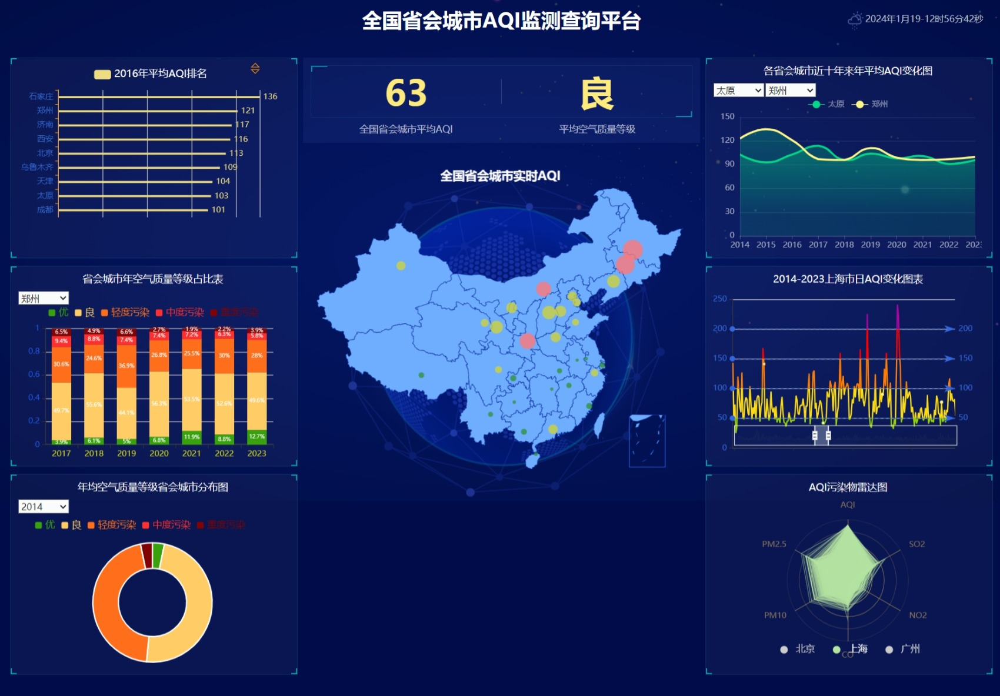
***

# 二、数据获取

******

## (1）AQI历史数据获取（各省会城市近十年数据）

 
###  ①  数据爬取过程：
 
>**从AQI历史数据查询网站(https://www.aqistudy.cn/historydata/)爬虫获得**
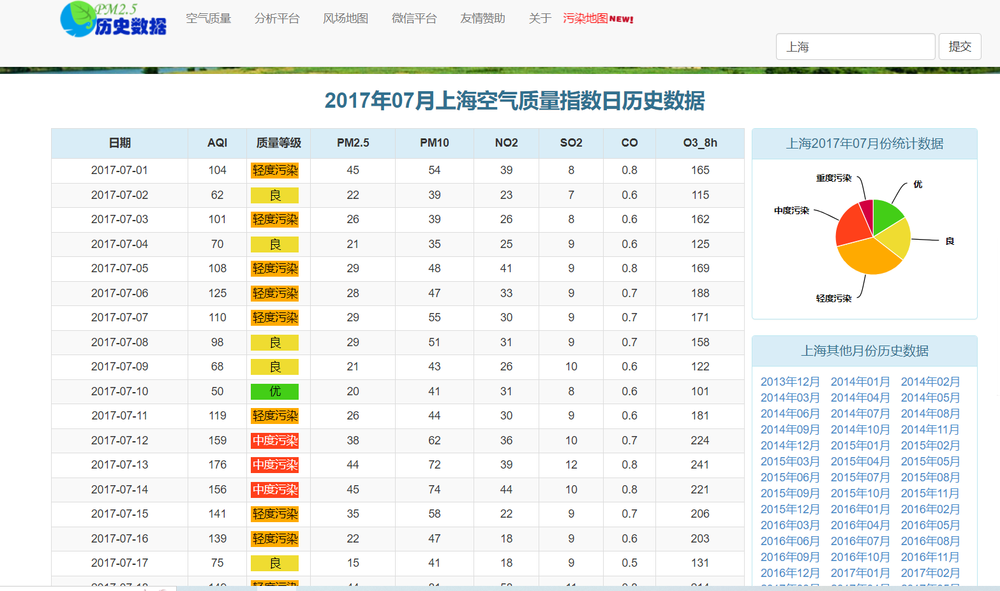
***注：上述图片来自https://www.aqistudy.cn/historydata/daydata.php?city=%E4%B8%8A%E6%B5%B7&month=201707***

******

*分析网页，采取requests爬虫:*

**直接进行request爬虫爬取结果：**

>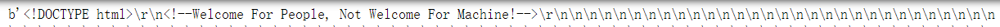

**受限网站反爬机制，爬出结果为空。分析原因，改进爬虫代码：**

**-网页反爬限制-：**

+ **反调试：无限debugger + 禁用F12 + 禁用ctrl+shift+c + 禁用右键 ......**

>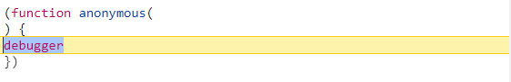
>
>
>

+ **JS动态返回，数据是动态加载的无法之前通过request请求得到对应的html**
+ **JS混淆**
+ **JS加密：请求参数加密且参数不固定 + 响应加密**

**-解决方案-：**

1. *分析源代码，发现无限debugger的原因在于txsdefwsw函数，在该函数前打个断点即可*

2. *禁用F12开发者工具,可以现在空白页面打开开发者工具，再进入该网址 (禁用ctrl+shift+c与禁用右键两个问题还未有效解决，不过有F12开发者工具的话影响不大)*

>**JS动态返回、JS混淆、JS加密解决方案(详见[history_data.py](./data/historyDataFetch/history_data.py))：**

3. *delay_0_y_s：在0到random_delay_num秒之间引入随机延迟。避免页面阻止频繁访问*
4. *getJS：从网站获取JavaScript代码，提取相关信息，并执行解码操作。动态解析JS加载的内容*
5. *getParames：使用提取的JavaScript代码生成用于发起API请求的签名*
6. *decrypt：JS解密函数，使用JavaScript上下文解密从API接收到的数据*
7. *getEncryptData：向指定的API端点发送包含加密数据的POST请求*


**注：JS混淆与加密的解决算法参考(https://github.com/xin5683/get_aqi)**

**historyData.py爬虫代码参数分析：**

>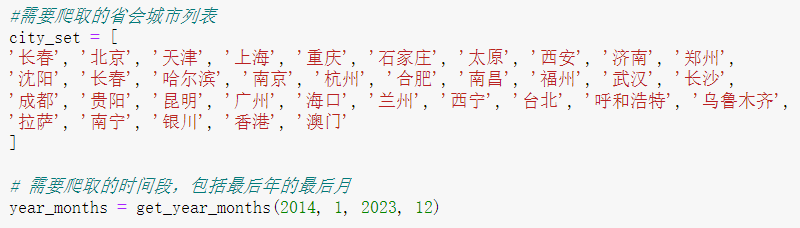
>*可以通过调整city_set和years_month的内容来爬取不同城市不同时间段的AQI数据*

***注：在实际爬取过程中，网页会对IP地址的频繁访问进行限制或封禁。通过更换网络节点，可以避免被封禁，继续进行爬取。也可将同city_set设置为一个省会城市分多次去爬取数据。***

**频繁更换网络节点也可能被视为滥用网站服务，违反了网站的使用条款。在进行网络爬虫时，建议先仔细阅读网站的robots.txt文件，了解网站的使用政策，并尊重网站的规定。**

******

### ②数据爬取结果：

>**单个城市近十年AQI数据（以上海市为例，从2014/01/01-2023/12/31的数据）：**
>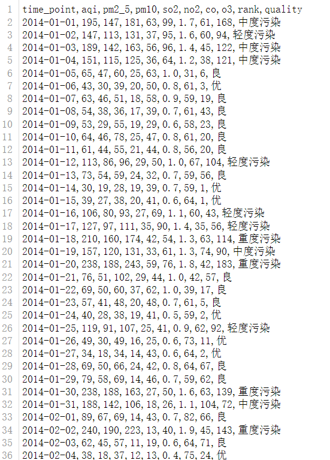

>**其余城市数据保存在对应的csv文件中([省会城市AQI数据](./data/AllData))：**

>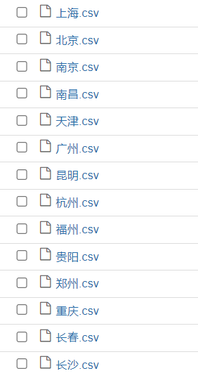

******


## （2）AQI实时数据获取

### ①数据爬取过程：

>**从空气质量在线监测平台爬取实时数据(https://www.aqistudy.cn/)**


******

**该网页的爬取限制于历史数据爬取类似，这里不做爬虫分析，直接给出结果：**

***运行[realtime_data.py](./data/realtimeDataFetch/realtime_data.py)，分析爬取内容，提取目标字段***
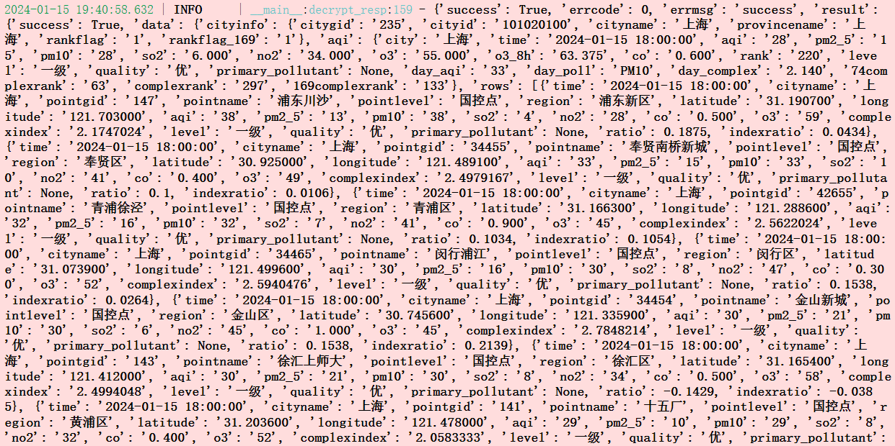

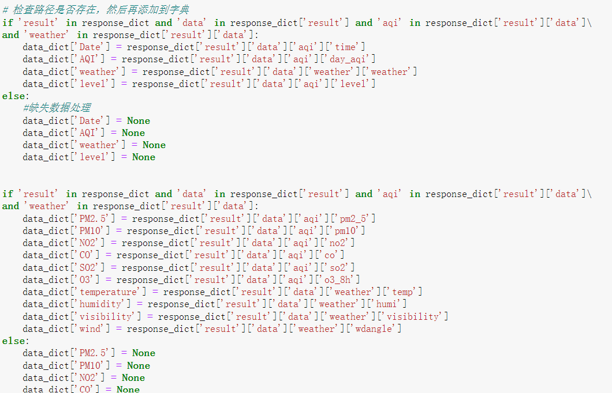

### ②实时数据爬取结果：

> 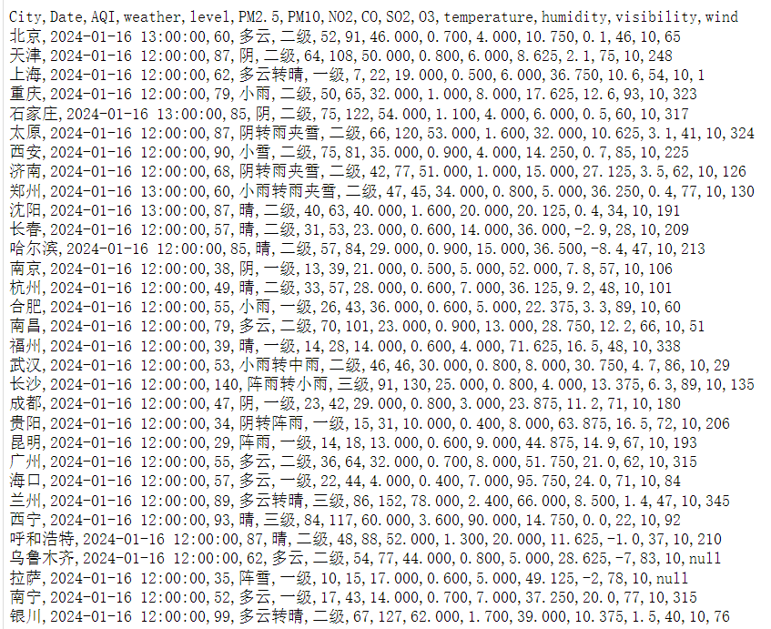


***
# 三、数据分析与可视化

## （一）数据预处理

***

> **先检测爬取的数据中是否有缺失数据，并将各省会城市2014/01/01-2023/12/31每日AQI相关数据整合成年度数据([总统计结果.csv](./data/dataAnalyse/总统计结果.csv))：**


```python

```


    文件中存在缺失数据。
    缺失数据统计：
    time_point     0
    aqi            0
    pm2_5          0
    pm10           0
    so2            0
    no2            0
    co             0
    o3             0
    rank          30
    quality        0
    年份             0
    dtype: int64
  

**可以看出每个省会城市AQI数据中缺失只有rank索引对应的数据（该数据是各省会城市日AQI等级的全国排名，可以通过各省会城市日AQI的值间接计算出来）**

**也就相当于AQI数据是无缺失的，无需对缺失数据项额外处理**
 
> **各省会城市AQI年度历史数据特征查看：**

```python
merged_result # 年度历史数据
```

<div>
<style scoped>
    .dataframe tbody tr th:only-of-type {
        vertical-align: middle;
    }

    .dataframe tbody tr th {
        vertical-align: top;
    }

    .dataframe thead th {
        text-align: right;
    }
</style>
<table border="1" class="dataframe">
  <thead>
    <tr style="text-align: right;">
      <th></th>
      <th></th>
      <th>平均AQI</th>
      <th>优</th>
      <th>良</th>
      <th>轻度污染</th>
      <th>中度污染</th>
      <th>重度污染</th>
    </tr>
    <tr>
      <th>城市</th>
      <th>年份</th>
      <th></th>
      <th></th>
      <th></th>
      <th></th>
      <th></th>
      <th></th>
    </tr>
  </thead>
  <tbody>
    <tr>
      <th rowspan="5" valign="top">上海</th>
      <th>2014</th>
      <td>80.457534</td>
      <td>64</td>
      <td>219</td>
      <td>59</td>
      <td>18</td>
      <td>5</td>
    </tr>
    <tr>
      <th>2015</th>
      <td>88.572603</td>
      <td>58</td>
      <td>197</td>
      <td>78</td>
      <td>25</td>
      <td>7</td>
    </tr>
    <tr>
      <th>2016</th>
      <td>80.819672</td>
      <td>72</td>
      <td>201</td>
      <td>73</td>
      <td>18</td>
      <td>2</td>
    </tr>
    <tr>
      <th>2017</th>
      <td>83.630137</td>
      <td>62</td>
      <td>208</td>
      <td>74</td>
      <td>18</td>
      <td>3</td>
    </tr>
    <tr>
      <th>2018</th>
      <td>70.065753</td>
      <td>115</td>
      <td>193</td>
      <td>48</td>
      <td>6</td>
      <td>2</td>
    </tr>
    <tr>
      <th>...</th>
      <th>...</th>
      <td>...</td>
      <td>...</td>
      <td>...</td>
      <td>...</td>
      <td>...</td>
      <td>...</td>
    </tr>
    <tr>
      <th rowspan="5" valign="top">长沙</th>
      <th>2019</th>
      <td>83.589041</td>
      <td>76</td>
      <td>199</td>
      <td>69</td>
      <td>13</td>
      <td>8</td>
    </tr>
    <tr>
      <th>2020</th>
      <td>70.775956</td>
      <td>123</td>
      <td>187</td>
      <td>47</td>
      <td>9</td>
      <td>0</td>
    </tr>
    <tr>
      <th>2021</th>
      <td>75.613699</td>
      <td>95</td>
      <td>209</td>
      <td>47</td>
      <td>7</td>
      <td>7</td>
    </tr>
    <tr>
      <th>2022</th>
      <td>71.391781</td>
      <td>116</td>
      <td>186</td>
      <td>57</td>
      <td>4</td>
      <td>2</td>
    </tr>
    <tr>
      <th>2023</th>
      <td>71.513736</td>
      <td>109</td>
      <td>211</td>
      <td>30</td>
      <td>7</td>
      <td>7</td>
    </tr>
  </tbody>
</table>
<p>310 rows × 6 columns</p>
</div>


> **各省会城市实时AQI数据查看:**


```python
history_data = pd.read_csv('../realtimeDataFetch/realtimeData.csv')
history_data.head()
```


<div>
<style scoped>
    .dataframe tbody tr th:only-of-type {
        vertical-align: middle;
    }

    .dataframe tbody tr th {
        vertical-align: top;
    }

    .dataframe thead th {
        text-align: right;
    }
</style>
<table border="1" class="dataframe">
  <thead>
    <tr style="text-align: right;">
      <th></th>
      <th>City</th>
      <th>Date</th>
      <th>AQI</th>
      <th>weather</th>
      <th>level</th>
      <th>PM2.5</th>
      <th>PM10</th>
      <th>NO2</th>
      <th>CO</th>
      <th>SO2</th>
      <th>O3</th>
      <th>temperature</th>
      <th>humidity</th>
      <th>visibility</th>
      <th>wind</th>
    </tr>
  </thead>
  <tbody>
    <tr>
      <th>0</th>
      <td>北京</td>
      <td>2024-01-18 16:00:00</td>
      <td>108</td>
      <td>晴转多云</td>
      <td>二级</td>
      <td>67</td>
      <td>88</td>
      <td>45.0</td>
      <td>0.9</td>
      <td>5.0</td>
      <td>24.375</td>
      <td>2.1</td>
      <td>53</td>
      <td>10</td>
      <td>235.0</td>
    </tr>
    <tr>
      <th>1</th>
      <td>天津</td>
      <td>2024-01-18 16:00:00</td>
      <td>68</td>
      <td>晴转多云</td>
      <td>一级</td>
      <td>18</td>
      <td>33</td>
      <td>34.0</td>
      <td>0.8</td>
      <td>11.0</td>
      <td>40.625</td>
      <td>2.9</td>
      <td>46</td>
      <td>10</td>
      <td>170.0</td>
    </tr>
    <tr>
      <th>2</th>
      <td>上海</td>
      <td>2024-01-18 16:00:00</td>
      <td>82</td>
      <td>小雨</td>
      <td>二级</td>
      <td>44</td>
      <td>52</td>
      <td>49.0</td>
      <td>1.1</td>
      <td>7.0</td>
      <td>11.500</td>
      <td>8.9</td>
      <td>90</td>
      <td>10</td>
      <td>92.0</td>
    </tr>
    <tr>
      <th>3</th>
      <td>重庆</td>
      <td>2024-01-18 16:00:00</td>
      <td>52</td>
      <td>小雨</td>
      <td>一级</td>
      <td>34</td>
      <td>47</td>
      <td>32.0</td>
      <td>1.0</td>
      <td>8.0</td>
      <td>14.125</td>
      <td>14.2</td>
      <td>76</td>
      <td>10</td>
      <td>93.0</td>
    </tr>
    <tr>
      <th>4</th>
      <td>石家庄</td>
      <td>2024-01-18 16:00:00</td>
      <td>133</td>
      <td>多云转阴</td>
      <td>三级</td>
      <td>91</td>
      <td>110</td>
      <td>38.0</td>
      <td>0.8</td>
      <td>2.0</td>
      <td>15.000</td>
      <td>1.6</td>
      <td>77</td>
      <td>10</td>
      <td>312.0</td>
    </tr>
  </tbody>
</table>
</div>


***
## （二） 数据可视化

 ###   ① **Matplotlib初步可视化**

> + **2014年至2023年期间各省会城市年平均AQI变化折线图：**

  
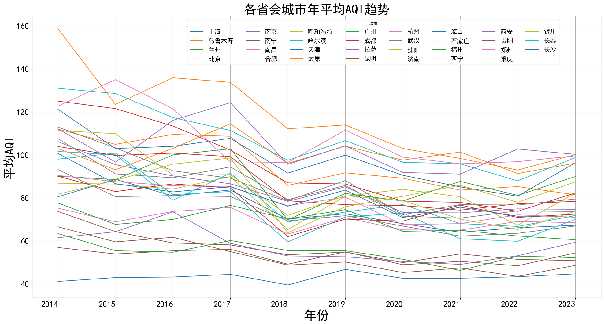
    


> + **2014年至2023年省会城市空气质量等级年占比堆积条形图（以上海市为例）:**


 
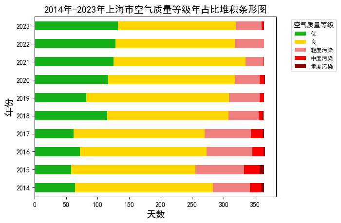
    


###  ② **APache ECharts数据可视化**

> **全国省会城市AQI监测查询大屏（[app.py](./app.py)）：**


<a name="ApacheCharts"></a>

> **大屏图表动图展示：**

> + **全国省会城市实时AQI信息地图（map）**


> + **全国省会城市年AQI动态排名图**
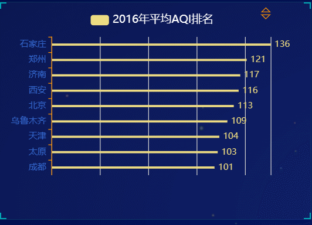

> + **2014-2023年全国省会城市年均AQI变化图**
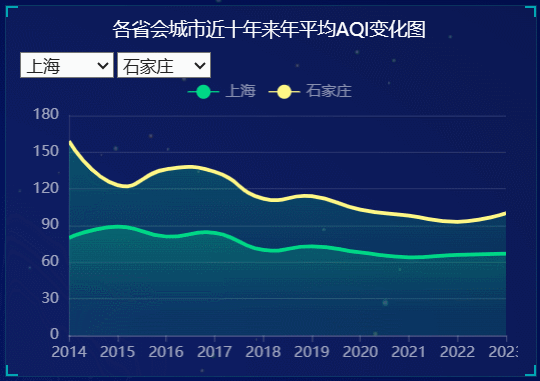

> + **全国省会城市年空气质量等级占比图**
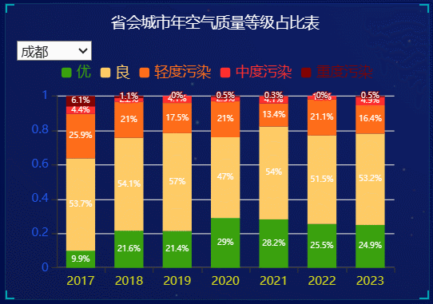

> + **2014-2023上海市日AQI变化图表**
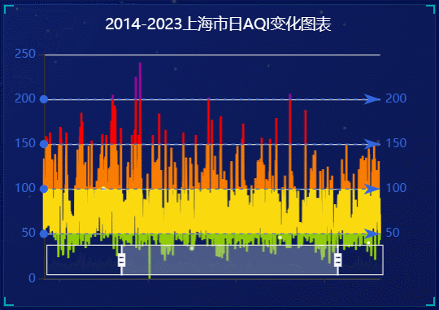

> + **年均空气质量等级省会城市分布图**
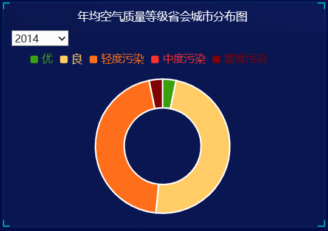

> + **AQI污染物雷达图**
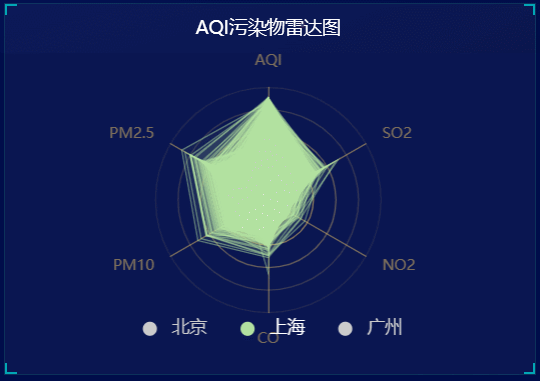


# 四、AQI时序预测模型构建

###  **[-模型构建代码-](./predictModel/model.ipynb)**

## （一）数据清洗与特征选择
*******


```python
import pandas as pd
import numpy as np
import matplotlib.pyplot as plt
import seaborn as sns

import warnings
warnings.filterwarnings("ignore")
warnings.simplefilter(action='ignore', category=FutureWarning)

df_main = pd.read_csv("AQI_prediction_dataset.csv")
df_main.head()
```


<div>
<style scoped>
    .dataframe tbody tr th:only-of-type {
        vertical-align: middle;
    }

    .dataframe tbody tr th {
        vertical-align: top;
    }

    .dataframe thead th {
        text-align: right;
    }
</style>
<table border="1" class="dataframe">
  <thead>
    <tr style="text-align: right;">
      <th></th>
      <th>Date</th>
      <th>PM2.5</th>
      <th>PM10</th>
      <th>NO2</th>
      <th>NOx</th>
      <th>CO</th>
      <th>SO2</th>
      <th>O3</th>
      <th>temp</th>
      <th>max_temp</th>
      <th>min_temp</th>
      <th>humid</th>
      <th>visible</th>
      <th>wind</th>
      <th>AQI</th>
    </tr>
  </thead>
  <tbody>
    <tr>
      <th>0</th>
      <td>01-01-2016</td>
      <td>56.40</td>
      <td>95.08</td>
      <td>51.73</td>
      <td>34.31</td>
      <td>0.69</td>
      <td>7.44</td>
      <td>55.96</td>
      <td>20.1</td>
      <td>28.4</td>
      <td>15.7</td>
      <td>54.0</td>
      <td>6.0</td>
      <td>3.0</td>
      <td>101</td>
    </tr>
    <tr>
      <th>1</th>
      <td>02-01-2016</td>
      <td>53.69</td>
      <td>93.92</td>
      <td>73.09</td>
      <td>54.77</td>
      <td>0.76</td>
      <td>8.67</td>
      <td>34.06</td>
      <td>20.8</td>
      <td>28.3</td>
      <td>12.9</td>
      <td>45.0</td>
      <td>6.3</td>
      <td>1.1</td>
      <td>92</td>
    </tr>
    <tr>
      <th>2</th>
      <td>03-01-2016</td>
      <td>62.35</td>
      <td>99.34</td>
      <td>77.77</td>
      <td>55.60</td>
      <td>0.96</td>
      <td>9.10</td>
      <td>47.62</td>
      <td>21.4</td>
      <td>29.0</td>
      <td>13.7</td>
      <td>45.0</td>
      <td>6.3</td>
      <td>0.4</td>
      <td>108</td>
    </tr>
    <tr>
      <th>3</th>
      <td>04-01-2016</td>
      <td>64.96</td>
      <td>104.62</td>
      <td>77.07</td>
      <td>50.81</td>
      <td>0.89</td>
      <td>8.87</td>
      <td>50.62</td>
      <td>21.5</td>
      <td>29.0</td>
      <td>15.2</td>
      <td>47.0</td>
      <td>6.9</td>
      <td>2.2</td>
      <td>109</td>
    </tr>
    <tr>
      <th>4</th>
      <td>05-01-2016</td>
      <td>70.15</td>
      <td>105.12</td>
      <td>79.43</td>
      <td>56.05</td>
      <td>0.85</td>
      <td>9.41</td>
      <td>36.94</td>
      <td>20.9</td>
      <td>28.4</td>
      <td>14.7</td>
      <td>51.0</td>
      <td>6.3</td>
      <td>1.1</td>
      <td>114</td>
    </tr>
  </tbody>
</table>
</div>


**将日期字符串转化为datetime64[ns]类型，使得可以更方便地在后续的时间序列分析中使用。**


```python
df_main["Date"] = pd.to_datetime(df_main["Date"], format="%d-%m-%Y")
df_main.info()
```

    <class 'pandas.core.frame.DataFrame'>
    RangeIndex: 1623 entries, 0 to 1622
    Data columns (total 15 columns):
     #   Column    Non-Null Count  Dtype         
    ---  ------    --------------  -----         
     0   Date      1623 non-null   datetime64[ns]
     1   PM2.5     1623 non-null   float64       
     2   PM10      1623 non-null   float64       
     3   NO2       1623 non-null   float64       
     4   NOx       1623 non-null   float64       
     5   CO        1623 non-null   float64       
     6   SO2       1623 non-null   float64       
     7   O3        1623 non-null   float64       
     8   temp      1623 non-null   float64       
     9   max_temp  1623 non-null   float64       
     10  min_temp  1623 non-null   float64       
     11  humid     1623 non-null   float64       
     12  visible   1623 non-null   float64       
     13  wind      1623 non-null   float64       
     14  AQI       1623 non-null   int64         
    dtypes: datetime64[ns](1), float64(13), int64(1)
    memory usage: 190.3 KB
    

***
**热力图查看有无数据缺失值**


```python
sns.heatmap(df_main.isnull())
```


    <Axes: >


    
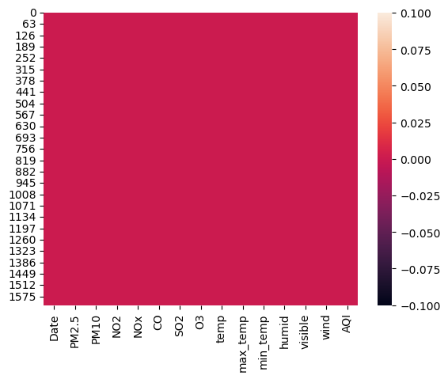
 
***
**热力图查看AQI与各空气污染物关系**

~~~python
df_main_no_date = df_main.drop('Date', axis=1)
# 计算相关性矩阵
correlation_matrix = df_main_no_date.corr()
# 绘制热力图
plt.figure(figsize=(12, 10))
sns.heatmap(correlation_matrix, annot=True, cmap='coolwarm', fmt=".2f")
~~~
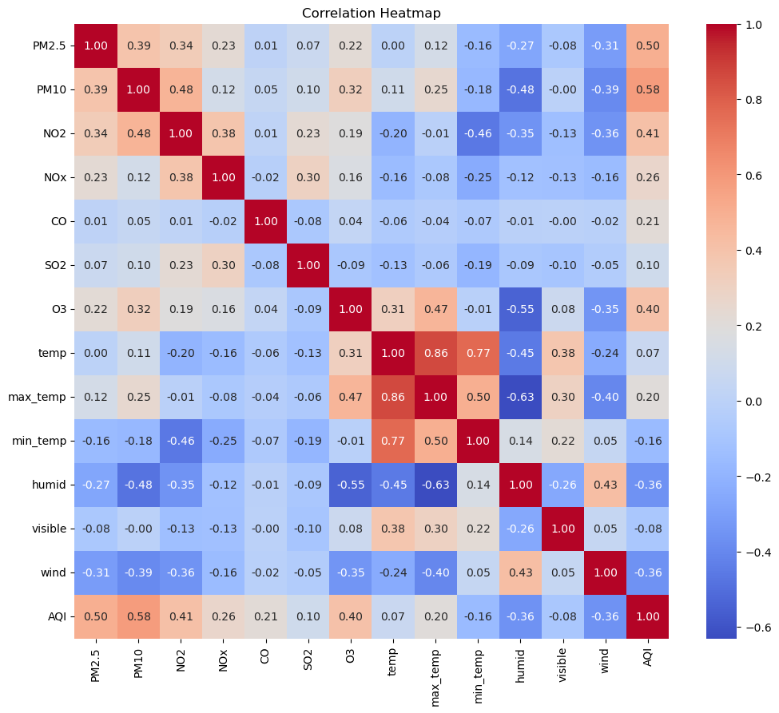

***
**选择PM2.5 PM10 NO2	NOx	CO	SO2	O3	temp max_temp min_temp	humid visible wind 作为数据特征**


```python
df_x = df_main.iloc[:, 0:13]  # 假设前13列是特征
df_y = df_main[['Date', 'AQI']]
df_x.head(5)
```


<div>
<style scoped>
    .dataframe tbody tr th:only-of-type {
        vertical-align: middle;
    }

    .dataframe tbody tr th {
        vertical-align: top;
    }

    .dataframe thead th {
        text-align: right;
    }
</style>
<table border="1" class="dataframe">
  <thead>
    <tr style="text-align: right;">
      <th></th>
      <th>Date</th>
      <th>PM2.5</th>
      <th>PM10</th>
      <th>NO2</th>
      <th>NOx</th>
      <th>CO</th>
      <th>SO2</th>
      <th>O3</th>
      <th>temp</th>
      <th>max_temp</th>
      <th>min_temp</th>
      <th>humid</th>
      <th>visible</th>
    </tr>
  </thead>
  <tbody>
    <tr>
      <th>0</th>
      <td>2016-01-01</td>
      <td>56.40</td>
      <td>95.08</td>
      <td>51.73</td>
      <td>34.31</td>
      <td>0.69</td>
      <td>7.44</td>
      <td>55.96</td>
      <td>20.1</td>
      <td>28.4</td>
      <td>15.7</td>
      <td>54.0</td>
      <td>6.0</td>
    </tr>
    <tr>
      <th>1</th>
      <td>2016-01-02</td>
      <td>53.69</td>
      <td>93.92</td>
      <td>73.09</td>
      <td>54.77</td>
      <td>0.76</td>
      <td>8.67</td>
      <td>34.06</td>
      <td>20.8</td>
      <td>28.3</td>
      <td>12.9</td>
      <td>45.0</td>
      <td>6.3</td>
    </tr>
    <tr>
      <th>2</th>
      <td>2016-01-03</td>
      <td>62.35</td>
      <td>99.34</td>
      <td>77.77</td>
      <td>55.60</td>
      <td>0.96</td>
      <td>9.10</td>
      <td>47.62</td>
      <td>21.4</td>
      <td>29.0</td>
      <td>13.7</td>
      <td>45.0</td>
      <td>6.3</td>
    </tr>
    <tr>
      <th>3</th>
      <td>2016-01-04</td>
      <td>64.96</td>
      <td>104.62</td>
      <td>77.07</td>
      <td>50.81</td>
      <td>0.89</td>
      <td>8.87</td>
      <td>50.62</td>
      <td>21.5</td>
      <td>29.0</td>
      <td>15.2</td>
      <td>47.0</td>
      <td>6.9</td>
    </tr>
    <tr>
      <th>4</th>
      <td>2016-01-05</td>
      <td>70.15</td>
      <td>105.12</td>
      <td>79.43</td>
      <td>56.05</td>
      <td>0.85</td>
      <td>9.41</td>
      <td>36.94</td>
      <td>20.9</td>
      <td>28.4</td>
      <td>14.7</td>
      <td>51.0</td>
      <td>6.3</td>
    </tr>
  </tbody>
</table>
</div>


```python
df_y.head(5)
```


<div>
<style scoped>
    .dataframe tbody tr th:only-of-type {
        vertical-align: middle;
    }

    .dataframe tbody tr th {
        vertical-align: top;
    }

    .dataframe thead th {
        text-align: right;
    }
</style>
<table border="1" class="dataframe">
  <thead>
    <tr style="text-align: right;">
      <th></th>
      <th>Date</th>
      <th>AQI</th>
    </tr>
  </thead>
  <tbody>
    <tr>
      <th>0</th>
      <td>2016-01-01</td>
      <td>101</td>
    </tr>
    <tr>
      <th>1</th>
      <td>2016-01-02</td>
      <td>92</td>
    </tr>
    <tr>
      <th>2</th>
      <td>2016-01-03</td>
      <td>108</td>
    </tr>
    <tr>
      <th>3</th>
      <td>2016-01-04</td>
      <td>109</td>
    </tr>
    <tr>
      <th>4</th>
      <td>2016-01-05</td>
      <td>114</td>
    </tr>
  </tbody>
</table>
</div>


***
## （二）模型训练集与测试集划分
******

**将原数据集的80%作为训练集，20%作为测试集**


```python
# 将数据拆分为训练集和测试集
split_index = int(0.8 * len(df_main))  # 80% 用于训练，20% 用于测试

df_x_train = df_x.iloc[:split_index, :]
df_y_train = df_y.iloc[:split_index, :]

df_x_test = df_x.iloc[split_index:, :]
df_y_test = df_y.iloc[split_index:, :]

# 将数据集保存为CSV文件
df_x_train.to_csv("train_x.csv", index=False)
df_y_train.to_csv("train_y.csv", index=False)
df_x_test.to_csv("test_x.csv", index=False)
df_y_test.to_csv("test_y.csv", index=False)

x_train = df_x_train.drop(['Date'], axis = 1)
y_train = df_y_train["AQI"]
x_test = df_x_test.drop(['Date'], axis = 1)
y_test = df_y_test["AQI"]
```

**模型数据标准化与归一化**


```python
from sklearn.preprocessing import StandardScaler, MinMaxScaler

sc_x = StandardScaler()
x_train = sc_x.fit_transform(x_train)
x_test = sc_x.transform(x_test)

sc_y = StandardScaler()
y_train = sc_y.fit_transform(np.array(y_train).reshape(-1,1))
y_test = sc_y.transform(np.array(y_test).reshape(-1,1))
```

**标准化后数据**


```python
x_train[:5]
```


    array([[ 0.64452375,  0.15265131,  1.53397359,  0.88701906, -0.17785498,
             0.98591707,  1.12788241, -1.8410119 , -0.75386963, -1.74104538,
            -0.54728196, -0.97174871],
           [ 0.54101309,  0.12322334,  3.15079158,  2.18525119, -0.14482841,
             1.51557503, -0.06419501, -1.54318259, -0.78787032, -2.90596254,
            -1.12831053, -0.4973565 ],
           [ 0.87178884,  0.26072297,  3.50503822,  2.23791652, -0.05046676,
             1.70074   ,  0.6739132 , -1.28790033, -0.54986551, -2.57312907,
            -1.12831053, -0.4973565 ],
           [ 0.97147991,  0.39467094,  3.45205261,  1.93398046, -0.08349334,
             1.60169827,  0.83721148, -1.24535329, -0.54986551, -1.9490663 ,
            -0.99919307,  0.45142793],
           [ 1.16971618,  0.40735541,  3.6306898 ,  2.26647002, -0.10236567,
             1.83423103,  0.09257134, -1.50063555, -0.75386963, -2.15708722,
            -0.74095815, -0.4973565 ]])


```python
y_train[:5]
```


    array([[ 0.17883525],
           [-0.04953744],
           [ 0.35645846],
           [ 0.3818332 ],
           [ 0.50870692]])


***
## （三）预测模型选择与训练
***

> ### ①多元线性回归模型(MLR)


```python
from sklearn.linear_model import LinearRegression
regressor = LinearRegression()
regressor.fit(x_train,y_train)
```


***
> **MLR模型预测结果**


```python
y_prediction =  regressor.predict(x_test)
y_test_stand = y_test
y_prediction_stand = y_prediction
y_test = sc_y.inverse_transform(y_test)
y_prediction = sc_y.inverse_transform(y_prediction)

result = pd.DataFrame()
result["ACTUAL AQI"] = y_test.flatten()
result["PREDICTED AQI"] = y_prediction
result["DIFFERENCE"] = result["ACTUAL AQI"] - result["PREDICTED AQI"]
result["PERCENTAGE ERROR"] = ( abs(result["ACTUAL AQI"] - result["PREDICTED AQI"] ) / result["ACTUAL AQI"] ) * 100
result.head(15)
```


<div>
<style scoped>
    .dataframe tbody tr th:only-of-type {
        vertical-align: middle;
    }

    .dataframe tbody tr th {
        vertical-align: top;
    }

    .dataframe thead th {
        text-align: right;
    }
</style>
<table border="1" class="dataframe">
  <thead>
    <tr style="text-align: right;">
      <th></th>
      <th>ACTUAL AQI</th>
      <th>PREDICTED AQI</th>
      <th>DIFFERENCE</th>
      <th>PERCENTAGE ERROR</th>
    </tr>
  </thead>
  <tbody>
    <tr>
      <th>0</th>
      <td>50.0</td>
      <td>52.405428</td>
      <td>-2.405428</td>
      <td>4.810856</td>
    </tr>
    <tr>
      <th>1</th>
      <td>52.0</td>
      <td>63.171489</td>
      <td>-11.171489</td>
      <td>21.483633</td>
    </tr>
    <tr>
      <th>2</th>
      <td>68.0</td>
      <td>64.378722</td>
      <td>3.621278</td>
      <td>5.325409</td>
    </tr>
    <tr>
      <th>3</th>
      <td>70.0</td>
      <td>64.132717</td>
      <td>5.867283</td>
      <td>8.381833</td>
    </tr>
    <tr>
      <th>4</th>
      <td>59.0</td>
      <td>55.349071</td>
      <td>3.650929</td>
      <td>6.188015</td>
    </tr>
    <tr>
      <th>5</th>
      <td>51.0</td>
      <td>53.608991</td>
      <td>-2.608991</td>
      <td>5.115669</td>
    </tr>
    <tr>
      <th>6</th>
      <td>61.0</td>
      <td>65.889212</td>
      <td>-4.889212</td>
      <td>8.015101</td>
    </tr>
    <tr>
      <th>7</th>
      <td>67.0</td>
      <td>66.766868</td>
      <td>0.233132</td>
      <td>0.347959</td>
    </tr>
    <tr>
      <th>8</th>
      <td>65.0</td>
      <td>65.194460</td>
      <td>-0.194460</td>
      <td>0.299169</td>
    </tr>
    <tr>
      <th>9</th>
      <td>74.0</td>
      <td>62.123186</td>
      <td>11.876814</td>
      <td>16.049748</td>
    </tr>
    <tr>
      <th>10</th>
      <td>73.0</td>
      <td>59.544241</td>
      <td>13.455759</td>
      <td>18.432547</td>
    </tr>
    <tr>
      <th>11</th>
      <td>68.0</td>
      <td>64.356281</td>
      <td>3.643719</td>
      <td>5.358410</td>
    </tr>
    <tr>
      <th>12</th>
      <td>65.0</td>
      <td>56.782363</td>
      <td>8.217637</td>
      <td>12.642519</td>
    </tr>
    <tr>
      <th>13</th>
      <td>57.0</td>
      <td>66.250745</td>
      <td>-9.250745</td>
      <td>16.229377</td>
    </tr>
    <tr>
      <th>14</th>
      <td>68.0</td>
      <td>59.379263</td>
      <td>8.620737</td>
      <td>12.677555</td>
    </tr>
  </tbody>
</table>
</div>


***
> **MLR模型评价**


```python
from sklearn.metrics import r2_score
from sklearn.metrics import mean_squared_error
from sklearn.metrics import mean_absolute_error
score = r2_score(y_test_stand,y_prediction_stand)
mean_error = mean_squared_error(y_test_stand,y_prediction_stand)
mae = mean_absolute_error(y_test_stand,y_prediction_stand)
print("R2 SCORE（决定系数）:", score)
print("mean_sqrd_error（均方误差）: ", mean_error)
print("Root mean squared error（均方根误差）:",np.sqrt(mean_error))
print("Mean Absolute error（平均绝对误差）：", mae)
```

    R2 SCORE（决定系数）: 0.8158947552296449
    mean_sqrd_error（均方误差）:  0.047328897674621444
    Root mean squared error（均方根误差）: 0.21755205738999905
    Mean Absolute error（平均绝对误差）： 0.16482457853456733
    

> **决定系数 为 0.8159，表明模型相对较好地解释了目标变量的方差。**

> **均方误差为 0.0473，表示模型的预测值与实际值之间的平方差相对较小。**

> **均方根误差为 0.2176，表示模型的预测值与实际值之间的平均距离相对较小。**

> **平均绝对误差为 0.1648，表示模型的平均预测误差相对较小。**

> **总体而言，模型在提供的评估指标下表现良好。**

***
> **MLR模型结果曲线**


```python
df1 = pd.DataFrame({'Actual': y_test[50:150].flatten(), 'Predicted': y_prediction[50:150].flatten()})
df1.plot(kind='line')
plt.grid(which='major', linestyle='-', linewidth='0.5', color='green')
plt.grid(which='minor', linestyle=':', linewidth='0.5', color='black')
plt.show()
```


    

    


**从模型预测结果可以发现，多元线性回归模型在AQI的时序预测上有较好的表现**

***
> ### ②随机森林模型(RF)

**数据处理与特征选择与MLR类似，这里不再赘述**

>**RF模型训练:**


```python
from sklearn.feature_selection import SelectKBest
from sklearn.feature_selection import mutual_info_regression

fs = SelectKBest(score_func=mutual_info_regression, k='all')
fs.fit(x_train, y_train)
x_train_fs = fs.transform(x_train)
x_test_fs = fs.transform(x_test)

from sklearn.ensemble import RandomForestRegressor
regressor = RandomForestRegressor()
regressor.fit(x_train_fs,y_train)
```


***
>**RF模型结果:**


```python
y_prediction =  regressor.predict(x_test_fs)

from sklearn.metrics import r2_score
from sklearn.metrics import mean_squared_error
from sklearn.metrics import mean_absolute_error
score = r2_score(y_test_stand,y_prediction)
mean_error = mean_squared_error(y_test_stand,y_prediction)
mae = mean_absolute_error(y_test_stand,y_prediction)
print("R2 SCORE（决定系数）:", score)
print("mean_sqrd_error（均方误差）: ", mean_error)
print("Root mean squared error（均方根误差）:",np.sqrt(mean_error))
print("Mean Absolute error（平均绝对误差）：", mae)
```

    R2 SCORE（决定系数）: 0.8108518920185419
    mean_sqrd_error（均方误差）:  0.04862529288162989
    Root mean squared error（均方根误差）: 0.22051143480924043
    Mean Absolute error（平均绝对误差）： 0.1711327370227373
    

> **决定系数 为 0.8109，表明模型相对较好地解释了目标变量的方差。**

> **均方误差为 0.04863，表示模型的预测值与实际值之间的平方差相对较小。**

> **均方根误差为 0.2205，表示模型的预测值与实际值之间的平均距离相对较小。**

> **平均绝对误差为 0.1711，表示模型的平均预测误差相对较小。**

> **总体而言，模型在提供的评估指标下表现良好。**


```python
y_prediction = y_prediction.reshape(-1, 1)
y_prediction = sc_y.inverse_transform(y_prediction)

result = pd.DataFrame()
result["ACTUAL AQI"] = y_test.flatten()
result["PREDICTED AQI"] = y_prediction
result["DIFFERENCE"] = result["ACTUAL AQI"] - result["PREDICTED AQI"]
result["PERCENTAGE ERROR"] = ( abs(result["ACTUAL AQI"] - result["PREDICTED AQI"] ) / result["ACTUAL AQI"] ) * 100
result.head(15)
```


<div>
<style scoped>
    .dataframe tbody tr th:only-of-type {
        vertical-align: middle;
    }

    .dataframe tbody tr th {
        vertical-align: top;
    }

    .dataframe thead th {
        text-align: right;
    }
</style>
<table border="1" class="dataframe">
  <thead>
    <tr style="text-align: right;">
      <th></th>
      <th>ACTUAL AQI</th>
      <th>PREDICTED AQI</th>
      <th>DIFFERENCE</th>
      <th>PERCENTAGE ERROR</th>
    </tr>
  </thead>
  <tbody>
    <tr>
      <th>0</th>
      <td>50.0</td>
      <td>52.13</td>
      <td>-2.13</td>
      <td>4.260000</td>
    </tr>
    <tr>
      <th>1</th>
      <td>52.0</td>
      <td>59.96</td>
      <td>-7.96</td>
      <td>15.307692</td>
    </tr>
    <tr>
      <th>2</th>
      <td>68.0</td>
      <td>66.96</td>
      <td>1.04</td>
      <td>1.529412</td>
    </tr>
    <tr>
      <th>3</th>
      <td>70.0</td>
      <td>62.65</td>
      <td>7.35</td>
      <td>10.500000</td>
    </tr>
    <tr>
      <th>4</th>
      <td>59.0</td>
      <td>55.59</td>
      <td>3.41</td>
      <td>5.779661</td>
    </tr>
    <tr>
      <th>5</th>
      <td>51.0</td>
      <td>57.27</td>
      <td>-6.27</td>
      <td>12.294118</td>
    </tr>
    <tr>
      <th>6</th>
      <td>61.0</td>
      <td>66.24</td>
      <td>-5.24</td>
      <td>8.590164</td>
    </tr>
    <tr>
      <th>7</th>
      <td>67.0</td>
      <td>67.26</td>
      <td>-0.26</td>
      <td>0.388060</td>
    </tr>
    <tr>
      <th>8</th>
      <td>65.0</td>
      <td>66.77</td>
      <td>-1.77</td>
      <td>2.723077</td>
    </tr>
    <tr>
      <th>9</th>
      <td>74.0</td>
      <td>64.78</td>
      <td>9.22</td>
      <td>12.459459</td>
    </tr>
    <tr>
      <th>10</th>
      <td>73.0</td>
      <td>64.95</td>
      <td>8.05</td>
      <td>11.027397</td>
    </tr>
    <tr>
      <th>11</th>
      <td>68.0</td>
      <td>61.13</td>
      <td>6.87</td>
      <td>10.102941</td>
    </tr>
    <tr>
      <th>12</th>
      <td>65.0</td>
      <td>56.42</td>
      <td>8.58</td>
      <td>13.200000</td>
    </tr>
    <tr>
      <th>13</th>
      <td>57.0</td>
      <td>61.82</td>
      <td>-4.82</td>
      <td>8.456140</td>
    </tr>
    <tr>
      <th>14</th>
      <td>68.0</td>
      <td>56.81</td>
      <td>11.19</td>
      <td>16.455882</td>
    </tr>
  </tbody>
</table>
</div>


>**RF模型结果曲线**


```python
df1 = pd.DataFrame({'Actual': y_test[50:150].flatten(), 'Predicted': y_prediction[50:150].flatten()})
df1.plot(kind='line')
plt.grid(which='major', linestyle='-', linewidth='0.5', color='green')
plt.grid(which='minor', linestyle=':', linewidth='0.5', color='black')
plt.show()
```


    
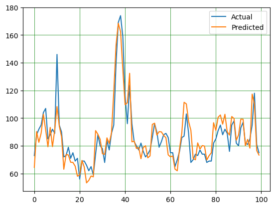
    


***
> ### ③支持向量机模型模型(SVR)

> **SVR模型训练:**


```python
from sklearn.svm import SVR
regressor = SVR(kernel = 'rbf')
regressor.fit(x_train,y_train)
```


> **SVR模型结果：**


```python
y_prediction =  regressor.predict(x_test)

score = r2_score(y_test_stand,y_prediction)
mean_error = mean_squared_error(y_test_stand,y_prediction)
mae = mean_absolute_error(y_test_stand,y_prediction)

print("R2 SCORE（决定系数）:", score)
print("mean_sqrd_error（均方误差）: ", mean_error)
print("Root mean squared error（均方根误差）:",np.sqrt(mean_error))
print("Mean Absolute error（平均绝对误差）：", mae)
```

    R2 SCORE（决定系数）: 0.8092195175632143
    mean_sqrd_error（均方误差）:  0.049044935916021624
    Root mean squared error（均方根误差）: 0.2214609128402157
    Mean Absolute error（平均绝对误差）： 0.16518709539127896
    

> **决定系数 为 0.8109，表明模型相对较好地解释了目标变量的方差。**

> **均方误差为 0.04904，表示模型的预测值与实际值之间的平方差相对较小。**

> **均方根误差为 0.2215，表示模型的预测值与实际值之间的平均距离相对较小。**

> **平均绝对误差为 0.1652，表示模型的平均预测误差相对较小。**

> **总体而言，模型在提供的评估指标下表现良好。**


```python
y_prediction = y_prediction.reshape(-1, 1)
y_prediction = sc_y.inverse_transform(y_prediction)

result = pd.DataFrame()
result["ACTUAL AQI"] = y_test.flatten()
result["PREDICTED AQI"] = y_prediction
result["DIFFERENCE"] = result["ACTUAL AQI"] - result["PREDICTED AQI"]
result["PERCENTAGE ERROR"] = ( abs(result["ACTUAL AQI"] - result["PREDICTED AQI"] ) / result["ACTUAL AQI"] ) * 100
result.head(15)
```


<div>
<style scoped>
    .dataframe tbody tr th:only-of-type {
        vertical-align: middle;
    }

    .dataframe tbody tr th {
        vertical-align: top;
    }

    .dataframe thead th {
        text-align: right;
    }
</style>
<table border="1" class="dataframe">
  <thead>
    <tr style="text-align: right;">
      <th></th>
      <th>ACTUAL AQI</th>
      <th>PREDICTED AQI</th>
      <th>DIFFERENCE</th>
      <th>PERCENTAGE ERROR</th>
    </tr>
  </thead>
  <tbody>
    <tr>
      <th>0</th>
      <td>50.0</td>
      <td>48.104838</td>
      <td>1.895162</td>
      <td>3.790325</td>
    </tr>
    <tr>
      <th>1</th>
      <td>52.0</td>
      <td>58.621436</td>
      <td>-6.621436</td>
      <td>12.733530</td>
    </tr>
    <tr>
      <th>2</th>
      <td>68.0</td>
      <td>65.560760</td>
      <td>2.439240</td>
      <td>3.587117</td>
    </tr>
    <tr>
      <th>3</th>
      <td>70.0</td>
      <td>64.976696</td>
      <td>5.023304</td>
      <td>7.176149</td>
    </tr>
    <tr>
      <th>4</th>
      <td>59.0</td>
      <td>52.270687</td>
      <td>6.729313</td>
      <td>11.405615</td>
    </tr>
    <tr>
      <th>5</th>
      <td>51.0</td>
      <td>54.549033</td>
      <td>-3.549033</td>
      <td>6.958888</td>
    </tr>
    <tr>
      <th>6</th>
      <td>61.0</td>
      <td>65.008288</td>
      <td>-4.008288</td>
      <td>6.570964</td>
    </tr>
    <tr>
      <th>7</th>
      <td>67.0</td>
      <td>64.841925</td>
      <td>2.158075</td>
      <td>3.221008</td>
    </tr>
    <tr>
      <th>8</th>
      <td>65.0</td>
      <td>65.225668</td>
      <td>-0.225668</td>
      <td>0.347182</td>
    </tr>
    <tr>
      <th>9</th>
      <td>74.0</td>
      <td>64.694543</td>
      <td>9.305457</td>
      <td>12.574942</td>
    </tr>
    <tr>
      <th>10</th>
      <td>73.0</td>
      <td>63.432002</td>
      <td>9.567998</td>
      <td>13.106847</td>
    </tr>
    <tr>
      <th>11</th>
      <td>68.0</td>
      <td>58.955901</td>
      <td>9.044099</td>
      <td>13.300146</td>
    </tr>
    <tr>
      <th>12</th>
      <td>65.0</td>
      <td>55.900041</td>
      <td>9.099959</td>
      <td>13.999937</td>
    </tr>
    <tr>
      <th>13</th>
      <td>57.0</td>
      <td>58.467728</td>
      <td>-1.467728</td>
      <td>2.574961</td>
    </tr>
    <tr>
      <th>14</th>
      <td>68.0</td>
      <td>51.283295</td>
      <td>16.716705</td>
      <td>24.583389</td>
    </tr>
  </tbody>
</table>
</div>


> **SVR模型曲线**


```python
df1 = pd.DataFrame({'Actual': y_test[50:150].flatten(), 'Predicted': y_prediction[50:150].flatten()})
df1.plot(kind='line')
plt.grid(which='major', linestyle='-', linewidth='0.5', color='green')
plt.grid(which='minor', linestyle=':', linewidth='0.5', color='black')
plt.show()
```


    

    


### 预测模型总结
> + **从三种模型曲线的拟合程度上来看，三种模型都有较好的表现，说明通过时间序列来预测AQI是科学的。**
>+ **从三种模型的决定系数、均方误差、均方根误差、平均绝对误差指标来看，这三种模型在给定的任务中表现相当，并且没有明显的优劣之分。选择最适合的模型可能需要考虑具体的应用场景、模型的解释性以及其他因素。在实际应用中，建议进行进一步的交叉验证和模型调优，以确保模型在不同数据集上的性能稳定。**


```python

```

# 五、项目总结

### 项目分析结果：
+ **整体趋势：2014年到2023年各省会城市AQI呈现下降趋势，这与近些年国家大力推崇的环境保护政策密不可分** 
+ **2014-2023十年内平均AQI最低五大省会城市：海口: 43.0, 贵阳: 52.6, 昆明: 52.8, 福州': 54.7, 南宁: 56.9**
+ **2014-2023十年内平均AQI最高五大省会城市：太原': 100.0, 西安: 103.5, 济南': 107.1, 郑州: 107.5, 石家庄: 117.2**
+ **AQI与地区关系：北部内陆地区和西北部地区的空气质量较差： 中国的北部内陆地区以及西北部地区的空气质量相对较差，可能受到工业污染等因素的影响。沿海地区和高原地区的空气质量较好： 沿海地区和高原地区的空气质量相对较好，可能受到地理环境和气候等因素的影响。**
+ **主要污染物分析： 空气质量最差省份的主要污染物是pm10、so2、no2。在空气质量最差城市，主要污染物包括pm2.5、pm10、so2、no2。so2与no2之间、pm2.5与pm10、so2、no2之间有较强的正相关关系**
+ **AQI与季节关系： 全国空气质量冬季时最差，平均AQI为91.6（良好），夏季时最好，平均AQI为67.9（良好）**

### 项目不足与值得改进的地方：

+ **数据考虑不够充分：未考虑每个城市的特殊因素，如工业结构、交通状况、人口密度等，这些指标与AQI有着密切联系。**
+ **预测模型不够准确：受限于数据的获取与模型的选择，AQI的时序预测模型存在一定的限制**
+ **可改进地方：获取更多城市的数据以及其它与AQI密切相关的数据（如城市人口密度，城市经纬度，城市气候等）以改善数据可视化程度的与预测模型的准确性**
